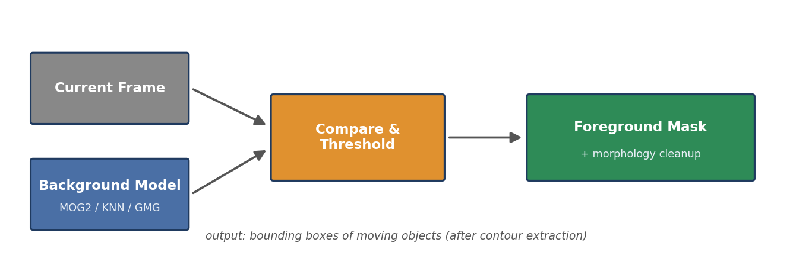
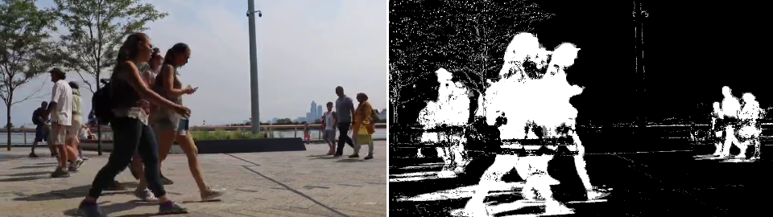
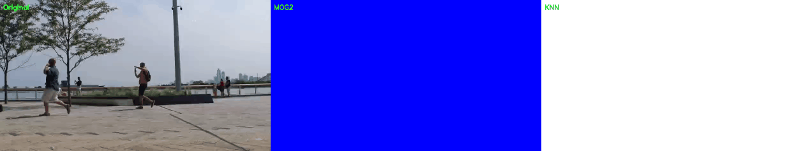

# 01 — Soustraction de fond

Détection d'objets en mouvement en modélisant le fond de la scène et en marquant comme premier plan tout ce qui s'en écarte.



## Principe

Toutes les méthodes suivent le même squelette — seul le *modèle de fond* change :

1. **Modéliser le fond** — MOG2 ajuste un mélange gaussien par pixel ; KNN garde les échantillons récents par pixel ; GMG fait une estimation bayésienne sur les premières images
2. **Classifier chaque nouveau pixel** — premier plan s'il n'appartient pas au modèle appris
3. **Nettoyer** — ouverture morphologique contre le bruit, extraction de contours + filtre d'aire pour obtenir les boîtes englobantes

## Scripts

| Script | Description |
|--------|-------------|
| `diffirence.py` | **Différence d'images** naïve : différence absolue de deux frames grises consécutives + seuillage. Aucune mémoire du passé — rapide mais laisse des trous sur les objets lents. |
| `MOG2.py` | **MOG2** (mélange gaussien adaptatif) : chaque pixel modélisé par un mélange de gaussiennes ; détecte les ombres (grises dans le masque). |
| `Knn.py` | Modèle de fond **KNN** : un pixel est « fond » s'il est assez proche d'au moins K échantillons récents. |
| `knnavance.py` | Masque KNN → détection de contours → boîtes englobantes autour des personnes, avec filtre d'aire anti-bruit. |
| `mog2&knn.py` | Affichage côte à côte des masques MOG2 et KNN sur les mêmes images pour comparaison directe. |
| `mogmog2gmg.py` | Ajoute **GMG** à la comparaison — trois modèles statistiques simultanément. |
| `mog2knnAvance.py` | Classe de benchmark : mesure de FPS, nettoyage morphologique, stats par méthode sur un fichier vidéo. |
| `mog2knnV2.py` | Version finale consolidée du pipeline de benchmark. |

## Résultat

Masque MOG2 réel calculé sur la séquence test (paramètres identiques aux scripts) — les personnes apparaissent en blanc, le fond statique en noir :



## Démo

Comparaison MOG2 vs KNN sur les 5 premières secondes (Original | MOG2 | KNN, ombres en bleu) — générée par [`export_preview.py`](export_preview.py) :



## Enseignements clés

- **La gestion des ombres compte** : MOG2 marque les ombres en gris plutôt qu'en blanc, ce qui évite de fusionner des détections proches.
- L'**ouverture morphologique** (`cv2.morphologyEx`) supprime le bruit avant l'extraction de contours.
- Le **filtrage par aire** des boîtes (> ~1000 px) élimine les résidus de bruit.
- Les modèles statistiques (MOG2/KNN) s'adaptent aux changements d'éclairage progressifs ; la simple différence d'images non.

## Exécution

```bash
python mog2knnV2.py          # benchmark sur personnes_en_mouvement.mp4
python knnavance.py          # webcam live avec boîtes englobantes
```

> Les scripts attendent une vidéo de piétons nommée `personnes_en_mouvement.mp4` dans le répertoire courant (non redistribuée). Toute séquence similaire convient.

## Énoncé
Voir [Tp01.pdf](Tp01.pdf).
