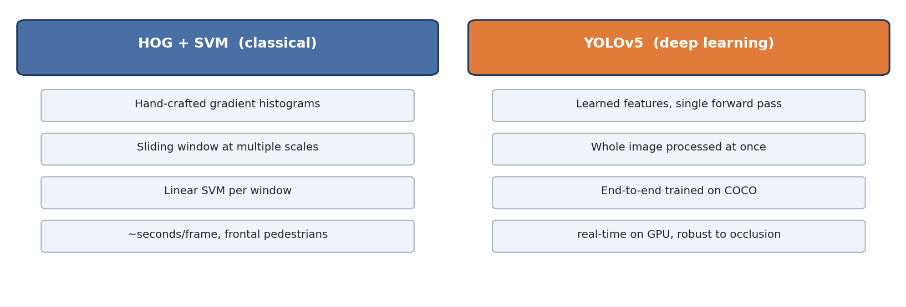

# 02 — Pedestrian Detection: HOG+SVM vs YOLOv5

> 🇫🇷 [Readme en français](README.fr.md)


Two generations of object detection applied to pedestrian footage:



1. **HOG + SVM** (classical): Histogram of Oriented Gradients features + a sliding-window linear SVM, OpenCV ships a pretrained pedestrian detector (`cv2.HOGDescriptor_getDefaultPeopleDetector`).
2. **YOLOv5** (deep learning): single-stage CNN detector, run via the official [ultralytics/yolov5](https://github.com/ultralytics/yolov5) repository.

## Contents

- `hog.py` — HOG-based pedestrian detection script *(placeholder — see status below)*
- The full experiment was run inside a local clone of **YOLOv5** with its own virtual environment; YOLOv5 brings its own dependency stack (`requirements.txt` in that repo). The framework itself is not re-hosted here — clone it upstream:

```bash
git clone https://github.com/ultralytics/yolov5
cd yolov5 && pip install -r requirements.txt
python detect.py --weights yolov5s.pt --source video.mp4   # pretrained COCO weights
```

## Key takeaways

- HOG+SVM works on clean, frontal pedestrians but struggles with occlusion, small scale, and motion blur.
- YOLOv5 detects all persons in one forward pass, handles crowded scenes, and runs in real time on GPU.
- Practical lesson: environment isolation (`venv`) matters — YOLOv5's dependency stack (torch version, opencv-python-headless conflicts) clashes easily with other projects.

## Test footage
Pedestrian crossing clip (`personnes.mp4`, not redistributed).
