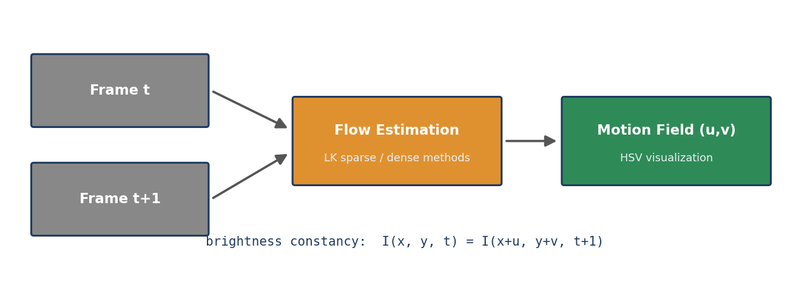
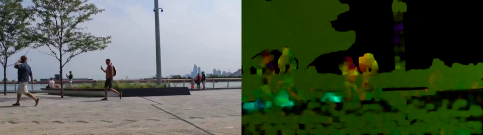
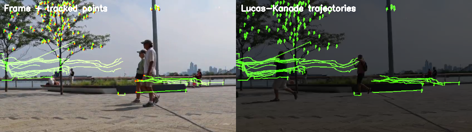
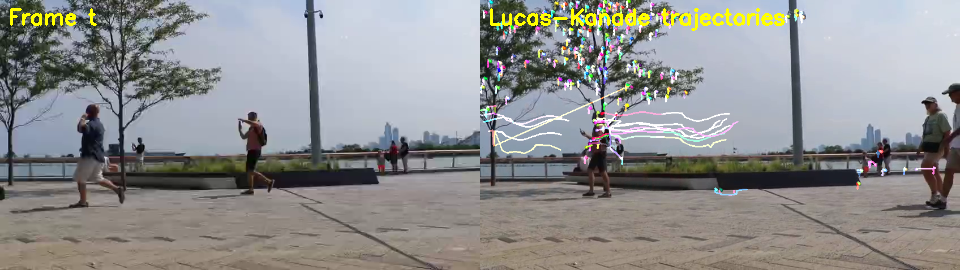

# 03 — Optical Flow

> 🇫🇷 [Readme en français](README.fr.md)


Estimating the per-pixel motion field between consecutive frames: for each pixel, a vector `(u, v)` describing its displacement from time `t` to `t+1`, under the brightness-constancy assumption `I(x, y, t) = I(x+u, y+v, t+1)`.

**Sparse flow** tracks a few interest points; **dense flow** computes a vector for *every* pixel.



## Dense flow in practice

Farnebäck output on the shared test clip — hue encodes motion direction, brightness encodes speed. The two walking pedestrians stand out clearly against the static background:



## Sparse flow in practice

Lucas–Kanade tracking of Shi–Tomasi corners on the shared test clip — accumulated trajectory trails reveal the pedestrians' motion paths:



## Sparse flow in practice

Lucas–Kanade trajectories on the shared test clip — each colored trail follows one Shi–Tomasi corner across frames:



## Scripts

| Script | Method | Type |
|--------|--------|------|
| `OF_LK.py` | **Lucas–Kanade** (`cv2.calcOpticalFlowPyrLK`) on Shi–Tomasi corners, with trajectory trails drawn on a persistent mask | sparse |
| `OF_FB.py` | **Farnebäck** (`cv2.calcOpticalFlowFarneback`) with HSV color-wheel visualization: hue = direction, saturation = magnitude | dense |
| `OF_FB_params.py` | Farnebäck with tunable pyramid/iterations parameters to study their effect | dense |
| `OF_CLG_GPU.py` | **CLG** (Claas–Lenk–Gelder?) variational method implemented in PyTorch with a coarse-to-fine pyramid | dense |
| `raft_cpu.py` | **RAFT** (Recurrent All-Pairs Field Transforms), pretrained deep model — CPU/GPU auto-switching | dense (deep) |
| `raft_gpu.py` | RAFT forced-GPU variant | dense (deep) |

## Install

```bash
pip install -r requirements.txt
```

## RAFT setup

The RAFT codebase and pretrained weights are not redistributed:

```bash
git clone https://github.com/princeton-vl/RAFT
# download weights and unzip into RAFT/models/
wget https://dl.dropboxusercontent.com/s/4j4z58wuv8o0mfz/models.zip
```

`raft_cpu.py` points at the clone via a `raft_root` variable, loads a chosen checkpoint (`raft-sintel.pth` by default), reads a video file instead of the webcam, and visualizes the flow as HSV. It automatically falls back to CPU when no NVIDIA GPU is present (slower, but functional).

## Key takeaways

- Lucas–Kanade is cheap and precise on textured corners but abandons textureless regions.
- Farnebäck gives full coverage but smooths across object boundaries.
- RAFT produces far sharper motion boundaries than classical methods and generalizes across scenes — at the cost of GPU compute.
- The HSV color wheel is the standard way to read dense flow: hue encodes direction, value encodes speed.

## Documentation

- 📄 Full written report (French): [`COMPTE_RENDU.md`](COMPTE_RENDU.md)
- Lab statement: [`TP3.pdf`](TP3.pdf) / [`TP3.docx`](TP3.docx)
