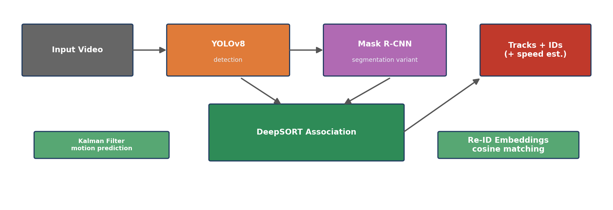

# 04 — Multi-Object Tracking: YOLOv8 + DeepSORT

> 🇫🇷 [Readme en français](README.fr.md)


Tracking-by-detection: a detector proposes objects in every frame, and a tracker links them into consistent identities over time.



## Pipeline

```
video ──► YOLOv8 detection ──► DeepSORT association ──► tracked boxes + stable IDs
              │                        │
              │                  Kalman filter (motion prediction,
              │                  handles short occlusions)
              │                  + appearance Re-ID embedding
              │                  (cosine distance matching)
              └── Mask R-CNN variant: instance segmentation masks
                  fed to the same association logic
```

## Contents

| File | Description |
|------|-------------|
| [`TP_DeepSORT.ipynb`](TP_DeepSORT.ipynb) | ⭐ **Main notebook** (Colab-ready, French): install → YOLOv8+DeepSORT tracking with per-track speed estimation → Mask R-CNN+DeepSORT segmentation → comparison table & chart |
| [`YOLOv8_DeepSORT_TRACKING_SCRIPT.ipynb`](YOLOv8_DeepSORT_TRACKING_SCRIPT.ipynb) | Earlier working version of the tracking script |
| [`deep_sort_pytorch/`](deep_sort_pytorch/) | The classic [DeepSORT](https://github.com/ZQPei/deep_sort_pytorch) core (Kalman filter, Hungarian assignment, Re-ID network) used for study |
| [`TP4.pdf`](TP4.pdf) | Lab statement |

## Results

YOLOv8 + DeepSORT on a street scene — IDs stay stable through crossings and partial occlusions:

<p align="center">
  
  
  
</p>

## Run

Open `TP_DeepSORT.ipynb` in Google Colab (GPU runtime recommended) or locally:

```bash
pip install ultralytics deep-sort-realtime
jupyter notebook TP_DeepSORT.ipynb
```

The notebook accepts either an uploaded video or a downloaded sample; annotated outputs are written to `output/`.

## Weights

Not redistributed — download automatically by the libraries:
- `yolov8n.pt` / `yolov8l.pt`: auto-downloaded by `ultralytics`
- DeepSORT Re-ID encoder `ckpt.t7`: from [ZQPei/deep_sort_pytorch](https://github.com/ZQPei/deep_sort_pytorch) (or the notebook's pip-installable alternative handles it)

## Key takeaways

- Detection quality bounds tracking quality — missed detections break identity chains.
- The Kalman filter bridges short occlusions; appearance features resolve ID switches after crossing pedestrians.
- Mask R-CNN adds pixel-accurate masks at roughly half the FPS of pure box detection (measured in the notebook's comparison section).
