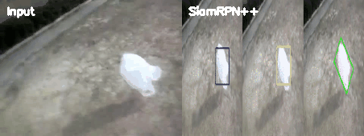

# 05 — Suivi Mono-Objet : SiamRPN++ avec PySOT

Les traceurs siamés apprennent l'apparence de la cible **une seule fois** (à partir de sa boîte englobante sur la première image), puis régressent sa position dans chaque image suivante — pas d'entraînement par classe, ça fonctionne sur n'importe quel objet dès le départ.

## Principe d'un traceur siamé

Le gabarit découpé sur l'image 1 et la zone de recherche courante passent dans le *même* CNN ; la corrélation croisée des deux cartes de caractéristiques produit une tête de réponse qui classe « où est la cible ? » et régresse « quelle est la taille de sa boîte ? » :


## Travail réalisé

Exécution complète du framework [PySOT](https://github.com/STVIR/pysot) :

- Installation de PySOT depuis les sources (compilation de l'extension Cython incluse)
- Utilisation du traceur pré-entraîné **SiamRPN++** (`siamrpn_r50_l234_dwxcorr`, backbone ResNet-50, corrélation croisée depth-wise)
- Suivi d'un sac malgré occlusions et changements d'échelle dans `bag.avi`

## Résultat

Entrée vs sortie SiamRPN++, côte à côte — le traceur garde le sac verrouillé malgré la déformation et l'arrière-plan :



GIF de sortie pleine résolution :


## Reproduire

```bash
# 1. Installer PySOT
git clone https://github.com/STVIR/pysot
cd pysot
python setup.py build_ext --inplace
pip install .

# 2. Télécharger le modèle depuis le model zoo PySOT
#    https://github.com/STVIR/pysot/blob/master/MODEL_ZOO.md
#    -> siamrpn_r50_l234_dwxcorr.pth  (~180 Mo, non redistribué ici)

# 3. Suivre
python demo_pysot.py \
    --config config.yaml \
    --snapshot siamrpn_r50_l234_dwxcorr.pth \
    --video bag.avi
```

`demo_pysot.py` est le driver de démo standard de PySOT ; on dessine une boîte sur la première image, et le traceur suit la cible pour tout le reste du clip, en écrivant une vidéo annotée en sortie.

## Enseignements clés

- Le suivi basé gabarit gère déformation et occlusion bien mieux que la corrélation de pixels bruts.
- La corrélation croisée depth-wise (`dwxcorr`) dans la tête RPN est ce qui donne à SiamRPN++ son équilibre précision/vitesse.
- Les poids de modèle dominent la taille d'un dépôt (~180 Mo) — bonne raison pour un portfolio de pointer vers les model zoos amont au lieu de les committer.
- Les fichiers étranges que certains lancements CLI créent (`--config`, `--snapshot` comme noms de fichiers littéraux) sont un piège argparse classique : oublier la forme `--cle=valeur` fait interpréter ces arguments comme positionnels par bash.

## Énoncé
Voir [TP5.pdf](TP5.pdf).
