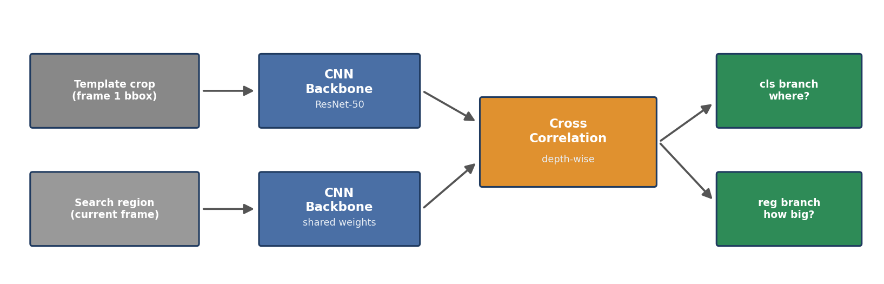
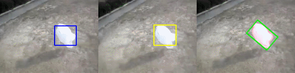

# 05 — Single-Object Tracking: SiamRPN++ with PySOT

Siamese trackers learn the target's appearance **once** (from its first-frame bounding box) and then regress where that template appears in every subsequent frame — no per-class training, works on any object out of the box.

## How a Siamese tracker works

The template crop from frame 1 and the current search region go through the *same* CNN; cross-correlating the two feature maps yields a response head that classifies "where is the target?" and regresses "how big is its box?":



## What was done

Ran the [PySOT](https://github.com/STVIR/pysot) framework end to end:

- Installed PySOT from source (Cython extension build included)
- Used the pretrained **SiamRPN++** tracker (`siamrpn_r50_l234_dwxcorr`, ResNet-50 backbone, depth-wise cross-correlation)
- Tracked a bag through occlusion and scale changes in `bag.avi`

## Result



## Run it yourself

```bash
# 1. Install PySOT
git clone https://github.com/STVIR/pysot
cd pysot
python setup.py build_ext --inplace
pip install .

# 2. Download the model from the PySOT model zoo
#    https://github.com/STVIR/pysot/blob/master/MODEL_ZOO.md
#    -> siamrpn_r50_l234_dwxcorr.pth  (~180 MB, not redistributed here)

# 3. Track
python demo_pysot.py \
    --config config.yaml \
    --snapshot siamrpn_r50_l234_dwxcorr.pth \
    --video bag.avi
```

`demo_pysot.py` is the standard PySOT demo driver; draw a box on the first frame, and the tracker follows the target for the rest of the clip, writing an annotated output video.

## Key takeaways

- Template-based tracking handles deformation and occlusion far better than correlation of raw pixels.
- Depth-wise cross-correlation (`dwxcorr`) in the RPN head is what gives SiamRPN++ its accuracy/speed balance.
- Model weights dominate repo size (~180 MB) — a good reason portfolios link to upstream model zoos instead of committing them.
- The odd files some CLI runs create (`--config`, `--snapshot` as literal filenames) are a classic argparse pitfall: forgetting `--key=value` form makes bash treat them as positional args.

## Lab statement
See [TP5.pdf](TP5.pdf).
