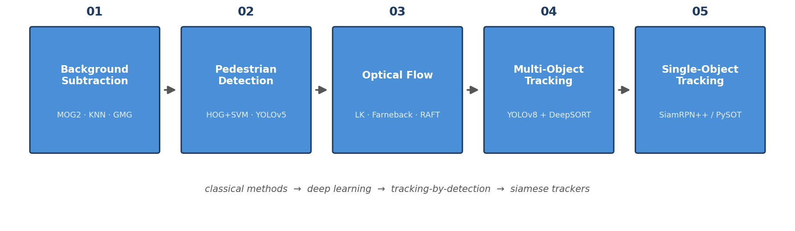
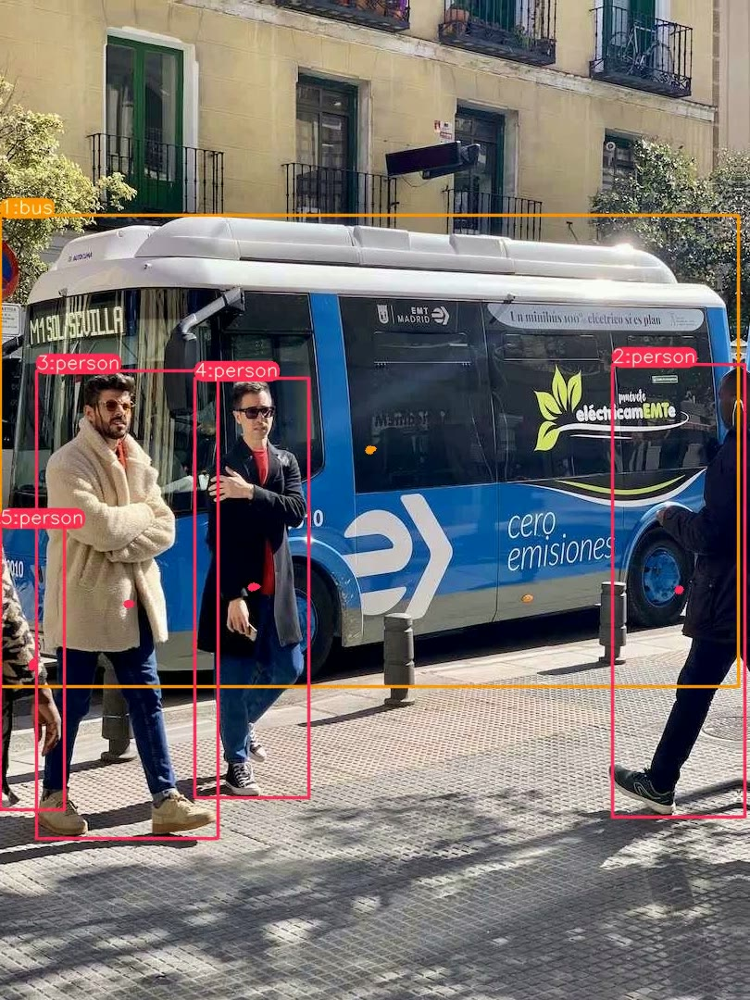
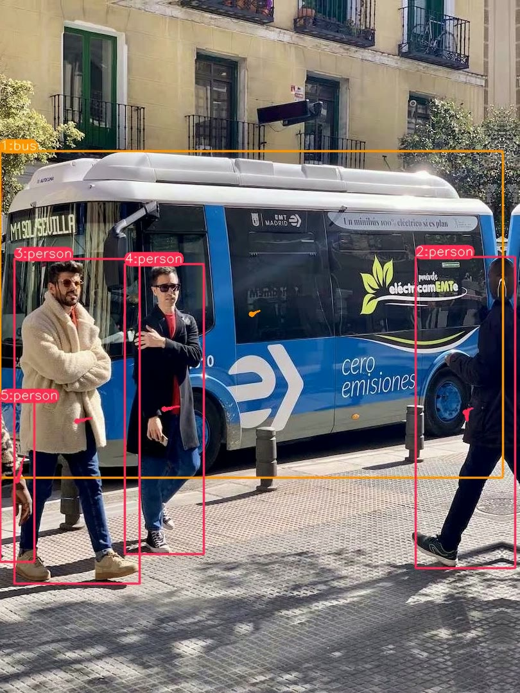
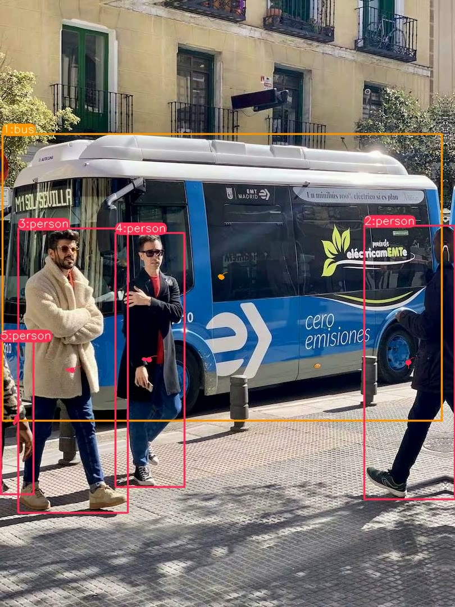

# Video Analysis & Object Tracking Portfolio

**From background subtraction to siamese tracking — a progressive journey through video analysis**
*Master BIAM 2025–2026 · Biomedical Video Analysis · FSDM, Université Sidi Mohamed Ben Abdellah*

  

> 🇫🇷 [Readme en français](README.fr.md)

---

This repository gathers five hands-on labs covering the core techniques of video analysis, ordered from classical to deep learning methods. Each module is self-contained with its own README, runnable scripts, and lab statement.

## The Journey



| # | Module | Technique family | Key tools |
|---|--------|-----------------|-----------|
| 01 | [Background Subtraction](01-background-subtraction/) | Frame differencing, GMM (MOG2), KNN, GMG | OpenCV |
| 02 | [Object Detection — HOG & YOLO](02-object-detection/) 🌟 | Classical feature-based vs. one-stage deep detection — incl. cataract mini-project | OpenCV HOG, YOLOv5 |
| 03 | [Optical Flow](03-optical-flow/) | Sparse (Lucas–Kanade) & dense flow (Farnebäck, CLG), deep flow estimation | OpenCV, PyTorch, RAFT |
| 04 | [Multi-Object Tracking — DeepSORT](04-multi-object-tracking-deepsort/) | Detection + tracking-by-detection, Kalman filter + appearance Re-ID | YOLOv8, DeepSORT, Mask R-CNN |
| 05 | [Single-Object Tracking — PySOT](05-single-object-tracking-pysot/) | Siamese networks: SiamRPN++ template matching | PySOT |

## Results Gallery

YOLOv8 + DeepSORT multi-object tracking on a street scene — stable IDs maintained across frames:

<p>
  
  
  
</p>

SiamRPN++ (PySOT) single-object tracking of a bag under occlusion and scale change:


## What Each Module Covers

### 01 — Background Subtraction
The foundation of moving-object detection: separating foreground from a learned background model.
- **Frame differencing**: simplest approach, no memory of the past
- **MOG2 / KNN / GMG**: Gaussian-mixture and nearest-neighbor background models compared side by side
- Benchmark script measuring FPS and mask quality across all methods, with contour extraction and bounding boxes

### 02 — Object Detection
Classical HOG+SVM detection vs. the YOLOv5 one-stage detector — applied to pedestrian footage in the lab and taken further in a **cataract-detection mini-project** (medical imaging): two full pipelines trained and compared on the same dataset → [eye-cataract-detection](https://github.com/jawadelMorabit-smi/eye-cataract-detection).

### 03 — Optical Flow
Motion as a per-pixel vector field:
- **Lucas–Kanade** sparse tracking of Shi–Tomasi corners with trajectory trails
- **Farnebäck** dense flow with HSV color-wheel visualization
- **RAFT**, a recurrent all-pairs field transforms deep model (pretrained weights), CPU/GPU auto-switching
- Full written report (`COMPTE_RENDU.md`, French)

### 04 — Multi-Object Tracking
Tracking-by-detection done right:
- YOLOv8 detection → DeepSORT association (Kalman filter motion prediction + cosine-distance appearance Re-ID)
- Speed estimation per track
- Mask R-CNN instance segmentation combined with DeepSORT, plus a comparison table of both pipelines

### 05 — Single-Object Tracking
Siamese trackers: learn a template in frame 1, regress its position in every following frame.
- SiamRPN++ (ResNet-50 backbone) via the PySOT framework
- Demo pipeline on `bag.avi` producing the GIF above

## Repository Layout

```
├── 01-background-subtraction/        MOG2 / KNN / GMG scripts + benchmark
├── 02-object-detection/              HOG vs YOLO + cataract detection project
├── 03-optical-flow/                  LK, Farnebäck, CLG, RAFT + report
├── 04-multi-object-tracking-deepsort/ YOLOv8+DeepSORT notebooks + DeepSORT core
├── 05-single-object-tracking-pysot/  SiamRPN++ demo script + result GIF
└── assets/                           Result images for this README
```

## Setup

Python ≥ 3.10. Each module has its own `requirements.txt` with only what it needs:

```bash
pip install -r 01-background-subtraction/requirements.txt   # OpenCV only
pip install -r 03-optical-flow/requirements.txt             # + PyTorch (RAFT)
pip install -r 04-multi-object-tracking-deepsort/requirements.txt
pip install -r 05-single-object-tracking-pysot/requirements.txt
```

Or install everything at once from the root:

```bash
pip install -r requirements.txt
```

> Heavy pretrained weights (RAFT `.pth` models, DeepSORT `ckpt.t7`, YOLOv8 `.pt`) are **not stored** in this repo. Each module's README explains exactly where to download them.

Most modules were developed against a shared test clip (`personnes_en_mouvement.mp4`); any pedestrian video works as a drop-in replacement.

## Modules Index

| Module | Start here | Statement |
|--------|-----------|-----------|
| Background Subtraction | [`mog2knnV2.py`](01-background-subtraction/mog2knnV2.py) | [Tp01.pdf](01-background-subtraction/Tp01.pdf) |
| Object Detection | [`02-object-detection/`](02-object-detection/) → [eye-cataract-detection](https://github.com/jawadelMorabit-smi/eye-cataract-detection) | — |
| Optical Flow | [`raft_cpu.py`](03-optical-flow/raft_cpu.py) | [TP3.pdf](03-optical-flow/TP3.pdf) |
| Multi-Object Tracking | [`TP_DeepSORT.ipynb`](04-multi-object-tracking-deepsort/TP_DeepSORT.ipynb) | [TP4.pdf](04-multi-object-tracking-deepsort/TP4.pdf) |
| Single-Object Tracking | [`demo_pysot.py`](05-single-object-tracking-pysot/demo_pysot.py) | [TP5.pdf](05-single-object-tracking-pysot/TP5.pdf) |

## Author

**Jaouad El Morabit** — Master BIAM 2025–2026, Biomedical Imaging

More of my work: [pipeline-pneumonia-cvd-colocalization](https://github.com/jawadelMorabit-smi/pipeline-pneumonia-cvd-colocalization) — GWAS×eQTL colocalization pipeline (bioinformatics) · [eye-cataract-detection](https://github.com/jawadelMorabit-smi/eye-cataract-detection) — HOG+SVM vs YOLOv5 · [radiogenomics-analytics-framework](https://github.com/jawadelMorabit-smi/radiogenomics-analytics-framework) — MGMT methylation from MRI.
